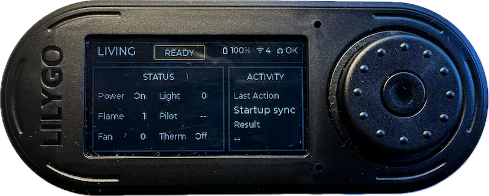

# Proflame2 Fireplace Control For Home Assistant

This integration lets you control a [Proflame2](https://proflame.sitgroup.it/eng/proflame-expertise/proflame-2-ifc-integrated-fireplace-control) fireplace from Home Assistant using a supported controller and your original handheld remote for setup. The Proflame2 fireplace receiver is part of a modular remote control and electronic ignition system used across many modern gas fireplace brands, log sets, and hearth appliances.


## What You Can Control

Available controls depend on the features installed in your fireplace and the
features you enable during setup.

- Power
- Flame level
- Fan level
- Light level
- Front burner
- Aux output
- CPI / pilot mode
- Saved fireplace profiles

## Supported Controllers

The supported controllers contain the radio needed to communicate with the Proflame2 fireplace receiver.  You need one supported controller for each fireplace and it must be close enough to the fireplace to work reliably in your home.

| Controller | Controls Fireplace | Guided Learning | Active Listening | Summary |
| --- | --- | --- | --- | --- |
| [LilyGO T-Embed CC1101](https://lilygo.cc/en-us/products/t-embed-cc1101?srsltid=AfmBOor4CV5ZFzLfUph39ge_hXsJLDdCJr-QSp_j1Uf7r1UL3xT1aWto) | Yes | Yes | Yes | Wi-Fi controller that can be installed near the fireplace. |
| [YardStick One](https://greatscottgadgets.com/yardstickone/) | Yes | Yes | No | USB controller connected to the Home Assistant host. |

### LilyGO T-Embed CC1101

LilyGO is a full-featured Proflame2 controller with a built-in display that shows the fireplace status and uses Wi-Fi to connect to Home Assistant.  This allows you to place the LilyGO in a convenient location near the fireplace to ensure reliable control.  With support for active listening, you can continue using the original remote while Home Assistant stays updated with the current fireplace status.



Note: ESPHome Builder is required in order to configure the LilyGO firmware.

Setup guide: [LilyGO CC1101 controller](docs/lilygo_cc1101_controller.md)

### YardStick One

YardStick One allows full control of the fireplace but does not have a display and does not currently support active listening. It connects directly to Home Assistant via USB, so setup is simpler because ESPHome Builder is not required. Since it remains connected to the computer running Home Assistant by USB, it may be harder to position close enough to the Proflame2 fireplace for reliable communication.

Setup guide: [YardStick controller](docs/yardstick_controller.md)

## Installation

There are two ways you can install the Proflame2 integration: [HACS](https://www.hacs.xyz) or manual.  The preferred approach is HACS since you will be notified of updates and can apply them easily through the HACS user interface.

### HACS

1. Open Home Assistant.
2. Open `HACS`.
3. Open `Custom repositories`.
4. Add this repository URL:
   `https://github.com/jeffgregx2/HACS-Proflame2`
5. Select category `Integration`.
6. Install the integration.
7. Restart Home Assistant.
8. Add the `Proflame2` integration from Home Assistant settings.

### Manual Install

HACS is the recommended install path. If you need a manual install, copy
`custom_components/proflame2` into `/config/custom_components/proflame2`, restart
Home Assistant, then add the `Proflame2` integration.

## First Setup

Once the Proflame2 integration is installed in Home Assistant, it is easy to add a fireplace:

1. Choose a controller: LilyGO T-Embed CC1101 or YardStick One.
2. Follow the controller setup guide linked above.
3. Add the `Proflame2` integration in Home Assistant.
4. Select the controller type.
5. For LilyGO, select the matching ESPHome device when prompted.
6. Start guided learning.
7. Hold the original remote within about 3 feet of the controller during
   learning.
8. Follow the prompts and press the requested buttons on the original remote.
9. Select the fireplace features your installation supports.
10. Validate basic controls from Home Assistant.

During setup, learning mode asks you to press specific buttons on your original fireplace remote.  This is used to learn the proper control codes used to establish communications.   You must have a functioning original remote in order to set up this integration.

Remember: If you are using a LilyGO controller, you must install it first before adding the fireplace.

## Range

Reliable range depends on the controller, its antenna, and how close it can be placed to the fireplace.

- LilyGO:
  - Internal antenna, shorter range.
  - Best to use within about 15 feet of the fireplace.
- YardStick:
  - External antenna, longer range.
  - Best to use within about 20 feet of the fireplace.
  - Range can improve with an antenna designed for 315 MHz, which is the frequency used by Proflame2 remotes.

These are practical starting points, not guarantees. Fireplace location, walls, metal, USB placement, Wi-Fi, and local interference can change the reliable range.

## Home Assistant Usage/Automation

After setup, Home Assistant can control the fireplace from dashboards, scripts,
scenes, automations, and profiles.

There are three different ways you can control your fireplace from within Home Assistant.

### Lovelace UI

Each fireplace created by this integration includes controls for the supported fireplace settings, such as Power, Flame, Fan, and Light. When you adjust those controls, the integration briefly waits before sending the update because Proflame2 fireplaces receive a complete fireplace state rather than individual setting changes. This allows several quick adjustments to be combined into one command instead of sending multiple one-second updates to the fireplace.

### Service Interface

Individual dashboard controls briefly wait before sending so multiple setting changes can be combined into one fireplace command. When an automation or script already knows the full desired fireplace state, use the `proflame2.set_state` service to send it immediately. For example:

```yaml
service: proflame2.set_state
target:
  device_id: YOUR_FIREPLACE_DEVICE_ID
data:
  power: true
  flame: 1
  fan: 0
  light: 0
  front: false
  aux: false
  cpi: false
```

Settings for features you did not enable during setup will be ignored.

### Profiles

A profile is a saved fireplace state with a name, such as `evening_relax`. Each profile defines all of the fireplace settings you want to apply, including power, flame, fan, light, and any other enabled features. Profiles are useful for common settings based on time of day or routine, similar to a Home Assistant scene. When you activate a profile, the full saved state is sent immediately:

```yaml
service: proflame2.apply_profile
target:
  device_id: YOUR_FIREPLACE_DEVICE_ID
data:
  profile_id: evening_relax
```

To manage profiles, open Settings -> Devices & services -> Proflame 2 Fireplace in Home Assistant and select the Gear icon next to your existing fireplace.  You can add, edit, or remove saved profiles there. Profiles can also appear as Home Assistant controls and can be called from automations.

For automations, use profiles or the service interface to ensure the fireplace is in the desired state.  Use of individual controls is less efficient and unless you change all controls the fireplace may not be in the desired state.  This is especially true if you continue to use the original remote.

## Active Listening

Active listening lets Home Assistant update when the original remote changes the
fireplace settings. This is supported by LilyGO and is enabled by default.

YardStick does not currently support active listening. It can learn from the original
remote during setup and it can control the fireplace, but it will not keep Home
Assistant synchronized when another remote is used later.

To change the Active Listening settings, open Settings -> Devices & services -> Proflame 2 Fireplace in Home Assistant and select the Gear icon next to your existing fireplace.  Select `Edit supported features` -> `Enable active listening` and change it to the desired value.

## Multiple Fireplaces

The Proflame2 integration can support multiple fireplaces.  Each fireplace will need its own controller set up using that fireplace's original remote.  Simply use "Add entry" multiple times, once per fireplace.

At this time, one controller can only control one fireplace.

## More Information

- [LilyGO CC1101 controller guide](docs/lilygo_cc1101_controller.md)
- [YardStick controller guide](docs/yardstick_controller.md)
- [ESPHome firmware build guide](docs/esphome_firmware_build.md)

## Warranty And Safe Operation

No warranty is provided. You are responsible for safe operation of your
fireplace and automation. Avoid unattended operation that could leave the
fireplace running longer than intended.
