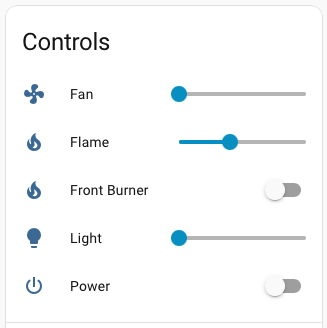

# Proflame2 Home Assistant Integration

Control a Proflame2 fireplace from Home Assistant using the same RF protocol as
the factory handheld remote.

This integration learns your fireplace remote, stores the learned identity, and
then exposes the fireplace as normal Home Assistant controls. It is intended for
day-to-day control, scenes, scripts, profiles, and state tracking when another
remote is used.



## What It Does

Proflame2 fireplaces are controlled by complete RF state packets, not simple
"button press" commands. This integration uses that model directly. When you
change a Home Assistant control, the integration sends the full desired
fireplace state as one RF command.

Supported control areas depend on your fireplace installation and the features
enabled during setup:

- Power
- Flame level
- Fan level
- Light level
- Front burner
- Aux output
- CPI or pilot mode
- Saved fireplace profiles

The original handheld remote is used during setup so the integration can learn
the remote serial ID and profile values needed to generate valid RF packets.

## RF Backends

The integration supports two RF controller families. Both are treated as normal
supported backends.

| Backend | TX | Learning | Active Listening | Summary |
| --- | --- | --- | --- | --- |
| LilyGO T-Embed CC1101 | Yes | Yes | Yes | ESPHome-based network RF node intended to live near the fireplace. |
| YardStick One | Yes | Yes | Receive-capable | USB RF backend using rfcat, useful as a direct Home Assistant-attached controller. |

### LilyGO T-Embed CC1101

The LilyGO backend uses ESPHome firmware and a CC1101 radio. It supports normal
transmit, guided learning, and active listening. Active listening lets Home
Assistant stay in sync when the native remote or another controller changes the
fireplace state.

Short tradeoff: this is usually the better always-on installation model because
the RF node can be placed near the fireplace, but it requires building and
deploying ESPHome firmware.

Setup details: [LilyGO CC1101 controller guide](docs/lilygo_cc1101_controller.md)

### YardStick One

The YardStick backend uses a USB YardStick One with rfcat. It supports transmit
and guided learning without ESPHome firmware. It is useful when a USB RF device
attached to the Home Assistant host is preferred.

Short tradeoff: this avoids ESPHome firmware, but it depends on USB passthrough
and the rfcat/libusb stack being reliable in your Home Assistant environment.

Setup details: [YardStick controller guide](docs/yardstick_controller.md)

## Installation

### HACS

1. Open Home Assistant.
2. Open `HACS`.
3. Open `Custom repositories`.
4. Add this repository URL:
   `https://github.com/jeffgregx2/HACS-Proflame2`
5. Select category `Integration`.
6. Install the integration.
7. Restart Home Assistant.
8. Add the `Proflame2` integration from Home Assistant settings.

### Manual Install

1. Copy `custom_components/proflame2` into your Home Assistant config directory:
   `/config/custom_components/proflame2`
2. Restart Home Assistant.
3. Add the `Proflame2` integration from Home Assistant settings.

## Basic Setup Flow

1. Choose the RF backend you want to use: LilyGO CC1101 or YardStick One.
2. Prepare the selected controller hardware.
3. Add the Proflame2 integration in Home Assistant.
4. Select the RF backend during setup.
5. Start guided learning.
6. Follow the prompts and press the requested buttons on the original remote.
7. Review or select the fireplace features your installation supports.
8. Finish setup and validate basic controls.
9. Optionally create saved profiles for common fireplace states.
10. Optionally enable active listening if supported by your controller and desired.

The learning flow is how the integration discovers the remote serial ID and
profile values for your fireplace. Do not skip learning unless you already have
known-good values from the same fireplace profile.

## ESPHome Firmware

LilyGO CC1101 installations require ESPHome firmware. This repository provides
source and package files, not prebuilt firmware binaries.

High-level build guidance is here:
[ESPHome firmware build guide](docs/esphome_firmware_build.md)

Use `esphome/examples/lilygo_cc1101_example.yaml` as the LilyGO reference
overlay after creating the base ESPHome device.

## Daily Use

After learning, Home Assistant becomes the normal control surface. You can use:

- Dashboard controls for direct operation.
- Saved profiles for common states such as low flame, evening mode, or warmup.
- Home Assistant scenes and scripts.
- Automations that call the Proflame2 services.
- Active listening, where supported, to keep state synchronized when another
  remote changes the fireplace.

Example direct service call:

```yaml
service: proflame2.set_state
target:
  device_id: YOUR_FIREPLACE_DEVICE_ID
data:
  power: true
  flame: 1
  fan: 0
  light: 0
```

Example profile service call:

```yaml
service: proflame2.apply_profile
target:
  device_id: YOUR_FIREPLACE_DEVICE_ID
data:
  profile_id: evening_relax
```

## More Information

- [LilyGO CC1101 controller guide](docs/lilygo_cc1101_controller.md)
- [YardStick controller guide](docs/yardstick_controller.md)
- [ESPHome firmware build guide](docs/esphome_firmware_build.md)
- [ESPHome source tree notes](esphome/README.md)

## Warranty And Safe Operation

No warranty is provided. You are responsible for safe operation of your
fireplace and automation. Avoid unattended operation that could leave the
fireplace running longer than intended.
